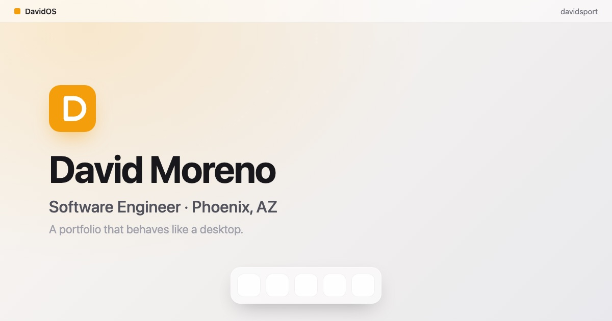

# DavidsPort

My personal portfolio — built as a small desktop operating system you can click
around in, rather than a page you scroll.

Open the dock at the bottom and each section (About, Projects, Resume, Contact,
Now Playing) opens in its own draggable, focusable window, complete with a menu
bar, z-order stacking, and a live clock. On phones the same content re-lays out
as full-screen sheets with a bottom tab bar — no dragging, no tiny windows.

**Live:** https://davidsport.vercel.app



---

## Stack

| | |
|---|---|
| **Framework** | React 18 |
| **Build tool** | Vite 5 |
| **Styling** | Tailwind CSS v4 (via `@tailwindcss/vite`) |
| **Animation** | Framer Motion 11 |
| **Hosting** | Vercel (static build) |

No router, no backend, no database — it's a single-page app whose "routing" is
the window manager. Content lives in plain JS data modules, so copy can be
edited without touching components.

## Running it locally

Requires **Node 18+**.

```bash
git clone https://github.com/dmoreno0716/DavidsPort.git
cd DavidsPort
npm install
npm run dev          # → http://localhost:5173
```

Other scripts:

```bash
npm run build        # production build → dist/
npm run preview      # serve dist/ locally to check the real build
```

## How it's put together

```
src/
├── App.jsx                  # providers (window manager, reduced-motion config)
├── windowManager.jsx        # the core: open windows, z-order, focus, spawn positions
├── useIsMobile.js           # matchMedia hook; drives the desktop ⇄ phone split
├── components/
│   ├── Desktop.jsx          # shell: wallpaper, and desktop-vs-mobile layout choice
│   ├── MenuBar.jsx          # top bar: wordmark, focused app name, clock
│   ├── Dock.jsx             # bottom dock (desktop)
│   ├── Window.jsx           # one draggable, focusable window
│   ├── icons.jsx            # hand-rolled line icons
│   ├── mobile/              # Sheet + TabBar — the phone layout
│   └── apps/                # the contents of each window
└── data/
    ├── apps.jsx             # window registry: dock apps + one window per project
    ├── projects.js          # project copy, links, screenshots, tech chips
    ├── profile.js           # name, bio, email, resume path
    └── music.js             # Spotify playlist embed
```

**The window manager** is the interesting piece. `windowManager.jsx` holds the
list of open windows and a separate z-order stack; opening an already-open
window raises it instead of duplicating it, and new windows spawn on a staggered
diagonal that wraps so they never march off-screen. Every window — including the
per-project detail views — is resolved through one `WINDOWS_BY_ID` registry, so
project windows get focus, stacking, and staggering for free.

**The mobile layout** is a structural swap, not just CSS. Below Tailwind's `md`
breakpoint the draggable `Window` never mounts at all; a single full-screen
`Sheet` renders the focused window instead, and the dock becomes a tab bar.

## Accessibility

- Dock, tab bar, windows, and project tiles are all real buttons — reachable by
  Tab, activated by Enter/Space.
- Opening a window moves focus into it; tabbing into a background window raises
  it. **Esc** closes the focused window.
- Icon-only controls carry `aria-label`s; decorative SVGs and thumbnails are
  hidden from screen readers so nothing is announced twice.
- Visible amber focus rings throughout, and `prefers-reduced-motion` is honored
  for both CSS transitions and Framer Motion animations.

## Performance notes

- Screenshots are resized to 1400px and served as JPEG (~600 KB total, down from
  3.5 MB of raw retina PNGs). Full-resolution originals are kept in `links/`,
  which is outside `public/` and therefore not deployed.
- The Spotify embed — the heaviest third-party asset — costs nothing until it's
  wanted: its component only mounts while the Now Playing window is open, so the
  iframe and all of Spotify's own requests start when that window first opens
  and never before. A first page load is 3 requests total.
- Images use `loading="lazy"`, `decoding="async"`, and intrinsic dimensions
  inside fixed-aspect containers, so nothing shifts as they load.

## Deploying

The repo is a stock static Vite build, so Vercel needs no configuration:
import the repo, keep the auto-detected **Vite** preset (`npm run build` →
`dist/`), and deploy.

If you deploy to a domain other than `davidsport.vercel.app`, update the
absolute `og:url`, `og:image`, and `canonical` URLs in `index.html` — link
previews depend on them being absolute.

---

**David Moreno** — Software Engineer, Phoenix, AZ
[dmore107@fiu.edu](mailto:dmore107@fiu.edu)
